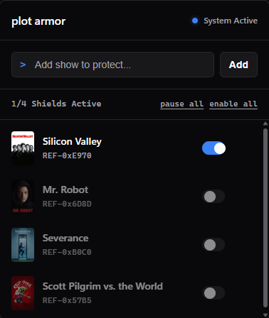

# Plot Armor

Plot Armor is a Chrome extension that helps reduce spoiler exposure while browsing.

Unlike pure keyword blockers, it combines local matching and semantic checks so it can still catch spoilers when the show title is not written directly.

## UI preview

Current popup UI:



## Current status

This is an active in-progress build (not production-hardened yet).

What works today:

- Add and remove protected titles from the popup.
- Toggle protection per title, plus pause all / enable all controls.
- TMDB-backed title suggestions (with poster thumbnails) while adding shows.
- Story context generation per title using TMDB metadata + OpenAI (with Wikipedia summaries when available).
- Hybrid detection pipeline:
  - Tier 1 deterministic/entity matching
  - Tier 2 semantic OpenAI classification when needed
- Blur + click-to-reveal behavior for likely spoiler content.
- False-positive reporting signal (`Not a spoiler?`) capture for later tuning.
- Multi-title semantic optimization: when one block matches multiple protected titles, the background service uses one combined LLM call instead of per-title sequential calls.
- Better popup UX polish (loading states, active/standby header state, improved readability and scrollbar styling).

## Tech stack

- Chrome Extension (Manifest V3)
- JavaScript
- OpenAI Chat Completions API
- TMDB API
- Chrome Storage API (`sync` + `local`)
- `MutationObserver` + `IntersectionObserver`

## Project files

- `manifest.json` - extension configuration
- `popup.html` / `popup.js` - popup UI and title management
- `background.js` - context generation, spoiler engine, API calls, cache
- `content.js` - page scanning, blur/reveal UI, observer orchestration
- `.env` - local API credentials (not committed)

## Setup

1. Clone this repo.
2. Create/update `.env` in the project root:

```env
OPENAI_API_KEY=your_openai_key
TMDB_READ_ACCESS_TOKEN=your_tmdb_read_token
```

3. Open `chrome://extensions`.
4. Enable **Developer mode**.
5. Click **Load unpacked** and select this project folder.

## Usage

1. Open the Plot Armor popup.
2. Add one or more titles to protect.
3. Browse content pages (for example Reddit or Wikipedia).
4. If a block is classified as likely spoiler content, it is blurred and can be revealed manually.

## Quick debug checklist

1. Open the extension service worker console from `chrome://extensions`.
2. Check saved state:

```js
chrome.storage.sync.get(["protectedShows", "activeProtectedShows"], console.log);
chrome.storage.local.get(["showContexts", "evalCache", "false_positives"], console.log);
```

3. Clear semantic verdict cache before retesting:

```js
chrome.storage.local.set({ evalCache: {} });
```

4. Clear generated show contexts for a fresh rebuild:

```js
chrome.storage.local.set({ showContexts: {} });
```

## Current known limits

- Detection precision is still being tuned (both false positives and misses occur).
- Results vary by page structure; Reddit and Wikipedia layouts are not fully uniform.
- LLM latency can still be noticeable on some pages.
- Context quality depends on upstream data quality and model consistency.

## Near-term priorities

- Reduce latency further (smarter gating, lower round trips).
- Improve comment-level precision on Reddit.
- Add a repeatable local fixture harness for spoiler/non-spoiler regression checks.
- Strengthen deterministic handling for relationship/twist edge cases.
- Add user progress awareness (block content beyond watched progress only).

## Safety note

This project sends page text snippets to OpenAI for analysis.

Do not commit real API keys, and avoid sharing screenshots that expose credentials.

