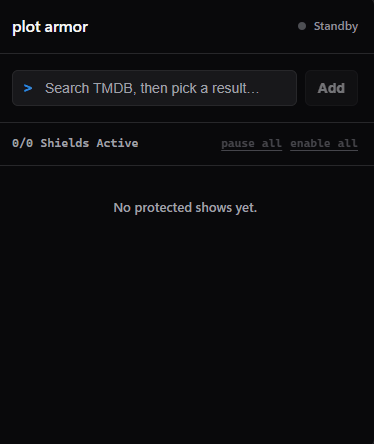
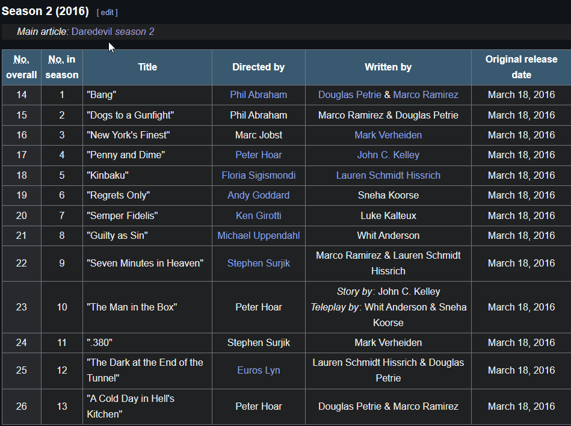
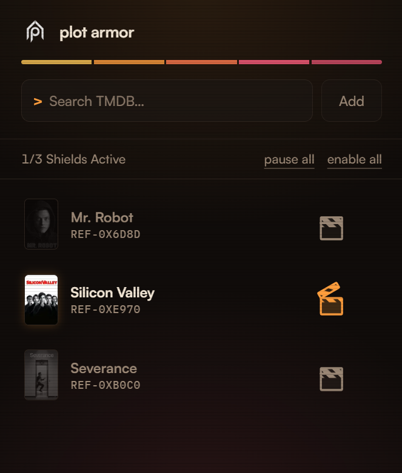
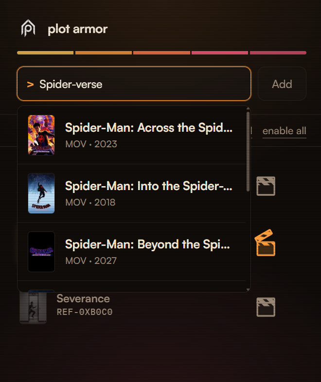
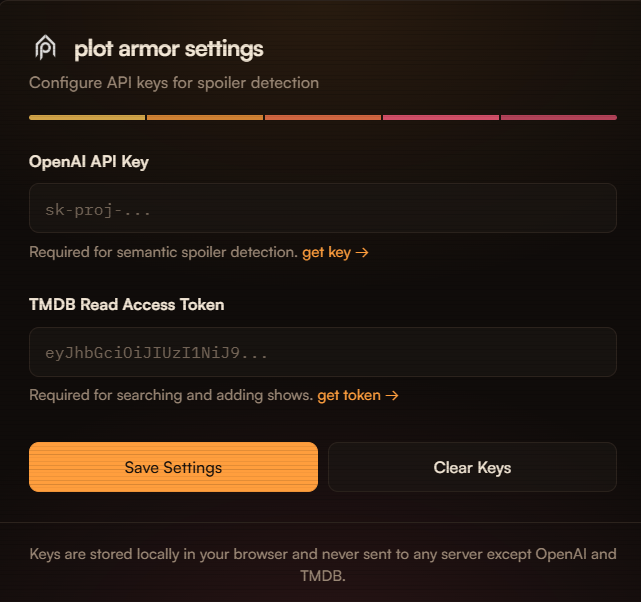

# Plot Armor

Plot Armor is a Chrome extension that helps reduce spoiler exposure while browsing.

Unlike pure keyword blockers, it combines local matching and semantic checks so it can still catch spoilers when the show title is not written directly.

## Demo

<div align="center">
  
</div>

<p align="center">
  <sub><strong>Adding a show:</strong> Search TMDB, select a result with poster preview, then click Add to protect that title.</sub>
</p>

<div align="center">
  
</div>

<p align="center">
  <sub><strong>Blocking in action:</strong> Spoiler content is automatically blurred and can be revealed with a click.</sub>
</p>

## UI preview

Scaled for the README (GitHub will still open full-size if you click an image).

<table>
  <tr>
    <th align="center" width="50%">Popup</th>
    <th align="center" width="50%">TMDB suggestions</th>
  </tr>
  <tr valign="top">
    <td align="center" width="50%">
      
    </td>
    <td align="center" width="50%">
      
    </td>
  </tr>
  <tr valign="top">
    <td align="center" width="50%">
      <div align="center"><sub>Protected shows, per-title toggles, search. <strong>Add</strong> stays off until you pick a suggestion.</sub></div>
    </td>
    <td align="center" width="50%">
      <div align="center"><sub>Live TMDB results with posters and type/year; choose a row, then <strong>Add</strong>.</sub></div>
    </td>
  </tr>
</table>

## Current status

This is an active in-progress build (not production-hardened yet).

What works today:

- Add and remove protected titles from the popup.
- **TMDB-verified adds:** type to search, **pick a row from the suggestion list**, then **Add**. The Add button stays disabled until you select a result—no free-text gibberish or typo titles that never match TMDB. Each add carries **TMDB id + media type** into the background so context resolution matches the intended movie/show.
- Toggle protection per title, plus pause all / enable all controls (stored in `activeProtectedShows`; the **background** spoiler check only considers titles that are not paused).
- TMDB search suggestions include **poster thumbnails** (`poster_path` from the API, loaded from `image.tmdb.org`; declared in `manifest.json` host permissions).
- Story context generation per title using TMDB metadata + OpenAI (with Wikipedia summaries when available).
- **Spoiler detection (`background.js`, detector `v14.7`):**
  <details>
  <summary>⚙️ Technical Deep-Dive: How Spoiler Detection Works (Tier 1 & 2)</summary>

  - **Tier 1** — fast entity/story-graph matching. The scan uses **main text plus optional preceding context** together so pronoun-only lines still pick up names from the line before.
  - **Escalation** — if Tier 1 does not match any entity, the pipeline **defaults to calling the LLM** whenever you have active shields, **unless** the snippet is very short or reads as **pure** meta (casting / reviews / release / production / music) with no spoiler-shaped cues. This favors **recall** over trying to list every possible "spoiler word" in regex form.
  - **Deterministic gates** — high-signal patterns can short-circuit to blur or hard-allow (e.g. relationship reveals, major spoiler-shaped cues with enough title context, speculative "leak" phrasing that overrides casting hard-allows, narrow **origin / injury reveal** phrasing when linked to a protected title). Full logic lives in `computeDeterministicSignals` / related helpers in `background.js`.
  - **Tier 2** — OpenAI JSON classifier using model knowledge; **missing story graphs** use an empty fallback so new titles still get judged. Semantic judge failures log a **normalized error payload** (not opaque `[object Object]`) for debugging.
  - **Verdict cache** — `evalCache` in `chrome.storage.local`, keyed in part by **detector version** (`DETECTOR_VERSION` in `background.js`) so rule changes don't reuse stale results. After pulling detector updates, clear cache (see debug checklist) or expect mixed old/new behavior until it expires naturally.
  - When multiple titles are in play (e.g. after escalation), the service may run **one LLM call per title** until it gets a confident spoiler hit or exhausts the list — good accuracy, higher API use than a single batched call.

  </details>
- **On-page behavior (`content.js`):**
  - Blur + click-to-reveal; **X/Twitter** uses a full-card veil (backdrop) so media stays covered reliably.
  - **Quote tweets:** quoted-card text is merged into the snippet sent for classification so quote-only spoilers are not skipped.
  - **Less “visible then blur”:** larger intersection prefetch margin (~`1400px`) plus eager queueing for near-viewport nodes so evaluation starts earlier on fast scroll.
  - **Reddit comments:** reveal is **per comment** (no inheriting “user revealed” from ancestors; nested stacked blurs don’t all peel on one click).
  - **Virtualized feeds (X):** removed nodes are cleaned up (unobserve + queue) so the timeline does not stall.
  - **Edge documents:** top-level `image/*` pages and missing `document.head` are handled without throwing; if `chrome.runtime` disappears after an extension reload, scanning **stops quietly** for that tab (refresh after reloading the extension).
  - **X — “not a spoiler?”** after reveal: compact chip is positioned using the **Grok** control when present (`aria-label="Grok actions"`, English UI); falls back to a fixed offset if that node is missing.
- False-positive reporting (`Not a spoiler?`): entries append to **`chrome.storage.local`** key **`false_positives`** (last **100** records: timestamp, url, show, text snippet, reason, confidence, source). Inspect via the debug checklist below.
- Popup UX: loading states, active/standby header, typography and scrollbar polish.

## Tech stack

- Chrome Extension (Manifest V3)
- JavaScript
- OpenAI Chat Completions API
- TMDB API
- Chrome Storage API (`sync` + `local`)
- `MutationObserver` + `IntersectionObserver`

<details>
<summary>📂 Repository Structure & File Map</summary>

## Project files

- `manifest.json` - extension configuration
- `popup.html` / `popup.js` - popup UI and title management
- `background.js` - context generation, spoiler engine, API calls, cache
- `content.js` - page scanning, blur/reveal UI, observer orchestration
- `tests/fixtures.json` - fixed spoiler/non-spoiler cases for regression checks
- `tests/run-fixtures.js` - paste into the service worker console to run fixtures
- `.env` - local API credentials (not committed; see `.gitignore`)
- `docs/popup-preview.png` / `docs/popup-tmdb-dropdown.png` - README UI screenshots

</details>

## Setup

1. Clone this repo.
2. Open `chrome://extensions`.
3. Enable **Developer mode**.
4. Click **Load unpacked** and select this project folder.

### Configuring API Keys

You can configure your API keys in two ways:

**Option 1: Extension Options Page (Recommended)**

Right-click the Plot Armor extension icon and select **Options**, or go to `chrome://extensions` and click **Extension options** under Plot Armor.

<div align="center">
  
  <br />
  <sub>Enter your OpenAI API key and TMDB Read Access Token in the extension options.</sub>
</div>

- **OpenAI API Key**: Get yours at [platform.openai.com/api-keys](https://platform.openai.com/api-keys)
- **TMDB Read Access Token**: Get yours at [themoviedb.org/settings/api](https://www.themoviedb.org/settings/api)

**Option 2: .env File (Legacy)**

Create a `.env` file in the project root:

```env
OPENAI_API_KEY=your_openai_key
TMDB_READ_ACCESS_TOKEN=your_tmdb_read_token
```

## Usage

1. Open the Plot Armor popup.
2. Type a few letters to search TMDB, **click a suggestion** (title + poster), then click **Add**. Repeat for each show or movie you want protected.
3. Browse content pages (for example Reddit, Wikipedia, or X).
4. If a block is classified as likely spoiler content, it is blurred and can be revealed manually.

<details>
<summary>🔍 Developer: Manual Debugging & Storage Checks</summary>

## Quick debug checklist

1. Open the extension service worker console from `chrome://extensions`.
2. Check saved state:

```js
chrome.storage.sync.get(["protectedShows", "activeProtectedShows"], console.log);
chrome.storage.local.get(["showContexts", "evalCache", "false_positives"], console.log);
```

3. Clear semantic verdict cache before retesting (do this after changing `DETECTOR_VERSION` or spoiler rules):

```js
chrome.storage.local.set({ evalCache: {} });
```

4. Clear generated show contexts for a fresh rebuild:

```js
chrome.storage.local.set({ showContexts: {} });
```

</details>

<details>
<summary>🧪 Deterministic Fixture Testing (50 Fixed Cases)</summary>

## Deterministic fixture testing (50 fixed cases)

Use this when you want consistent regression checks instead of manually scrolling random pages.

### Files

- `tests/fixtures.json` - fixed input set (50 cases)
- `tests/run-fixtures.js` - console runner script

### Run steps (service worker console)

1. Open `chrome://extensions`.
2. Find Plot Armor and click **Inspect views: service worker**.
3. Open `tests/run-fixtures.js` in your editor.
4. Copy the whole file and paste it into the service worker console.
5. Run:

```js
await runPlotArmorFixtures();
```

Optional:

```js
// Run only the first 10 cases
await runPlotArmorFixtures({ limit: 10 });

// Run specific fixture IDs
await runPlotArmorFixtures({ ids: ["PA-001", "PA-045"] });

// Force a cold semantic result per case (no reuse of evalCache between rows)
await runPlotArmorFixtures({ clearEvalCacheEachCase: true });
```

**Service worker note:** if DevTools says `runPlotArmorFixtures is not defined`, the worker restarted — paste `run-fixtures.js` again (or save it as a **Snippet**). The script calls `handleSemanticCheck` directly when run inside the service worker so `chrome.runtime.sendMessage` is not required there.

### Output

- Summary line in console, e.g. `42/50 passed`.
- Failure table with:
  - `id`
  - expected vs actual spoiler decision
  - expected vs actual matched show (when applicable)
  - model reason/confidence (if returned)

### Notes

- This suite hits the live semantic pipeline (`SEMANTIC_CHECK`), so it may consume OpenAI API calls. A full **50-case** run with `clearEvalCacheEachCase: true` can take on the order of **tens of seconds** — that is expected; real browsing still benefits from `evalCache` and only evaluating visible chunks.
- The runner temporarily overrides `protectedShows` / `activeProtectedShows` per case and restores your previous sync values in a `finally` block. You do **not** need those titles pre-added in the popup for the harness to run.
- Replace or extend `fixtures.json` if you want a different fixed batch of titles (keep `protectedShows` strings aligned with how you add titles in the UI).

</details>

## Current known limits

- **Non-TMDB blocking** (niche YouTube series, one-off events, manual keywords) is not in the popup yet. Everything in Protected Shows is tied to a TMDB pick.
- Detection precision is still being tuned (false positives and misses both happen).
- **Default LLM escalation** improves recall but increases **API cost and latency** versus a stricter local-only gate.
- Results vary by page structure; Reddit and Wikipedia layouts are not fully uniform.
- **Content script:** on storage changes, the current `resetAndReevaluate` path may **reveal all blurred blocks** before re-scanning — you can see a brief flash on some sites when the show list updates.
- **X report chip placement** depends on finding the Grok button by English `aria-label`; other locales may only get the CSS fallback offset.
- Context quality depends on upstream data and model behavior.

## Near-term priorities

- Cut LLM cost/latency where safe (e.g. batched multi-title judge, cheaper pre-filter) without losing recall-heavy behavior.
- Improve comment-level precision on Reddit.
- Soften storage-reset blur flicker in `content.js` when the protected list changes.
- Stronger handling of ambiguous “meta vs plot” lines without extra regex whack-a-mole.
- Optional: user progress awareness (only block past where you’ve watched).

## Safety note

This project sends page text snippets to OpenAI for analysis.

Do not commit real API keys, and avoid sharing screenshots that expose credentials.

